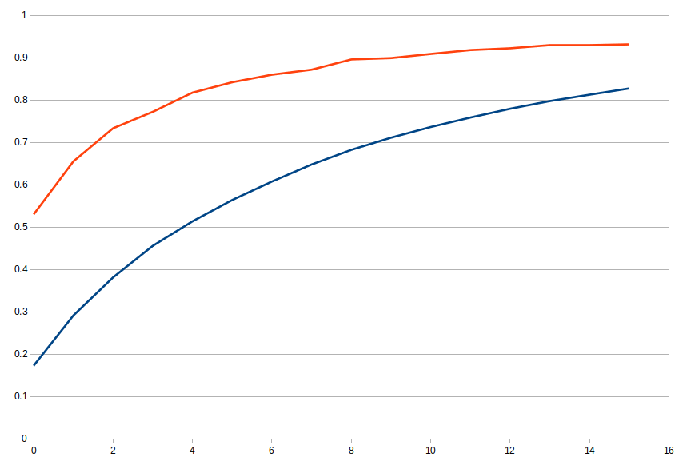

# WideOpenThoughts

Wide Open Thoughts is almost same software as [DeeperThought](https://github.com/pepe78/DeeperThought), but instead of CUDA C++ uses OpenCL C++ so that AMD GPU cards can be used as well as NVIDIA GPU cards.

Wide Open Thoughts is general framework for training Deep Neural Networks (and convolutional as well) using OpenCL C++.

To compile on linux:

> ./compile.sh

To run training using your train and test data from command line execute:

> ./wots configFile trainFile testFile batchSize(integer) paramFile/null saveEveryNEpochs(integer) square/log wheremax/netflix/none

## Input format of data:

expOut_1, ... , expOut_n, inp_1, ... , inp_m

For both trainFile and testFile (expOut - expected output, inp - input). One data point is one line.

## Good research publications on the topic:

* N. Srivastava, G. Hinton, A. Krizhevsky, I. Sutskever, R. Salakhutdinov: [Dropout: A Simple Way to Prevent Neural Networks from Overfitting](http://www.jmlr.org/papers/volume15/srivastava14a/srivastava14a.pdf?utm_content=buffer79b43&utm_medium=social&utm_source=twitter.com&utm_campaign=buffer), JMLR, 2014

* J. Masci, U. Meier, D. Ciresan, and J. Schmidhuber: [Stacked Convolutional Auto-Encoders for
Hierarchical Feature Extraction](https://www.researchgate.net/profile/Jonathan_Masci/publication/221078713_Stacked_Convolutional_Auto-Encoders_for_Hierarchical_Feature_Extraction/links/0deec518b9c6ed4634000000/Stacked-Convolutional-Auto-Encoders-for-Hierarchical-Feature-Extraction.pdf), Artificial Neural Networks and Machine Learning – ICANN, 2011

* H. Xiao, K. Rasul, R. Vollgra: [Fashion-MNIST: a Novel Image Dataset for
Benchmarking Machine Learning Algorithms](https://arxiv.org/pdf/1708.07747.pdf), Arxiv, 2017

## Results for MNIST dataset:

You can download [MNIST dataset here](https://www.dropbox.com/s/9eoiignb7tlrr2u/mnist.zip?dl=0). Mnist dataset can be found in other formats on [Yann Lecun's web page](http://yann.lecun.com/exdb/mnist/index.html) or [Kaggle's web page](https://www.kaggle.com/c/digit-recognizer).

### configG.txt (convolutional neural network CNN)

#### batch size 4000, log loss error, auto step size

> convolution,1,28,28,200,8,8,0.5,-0.001

> max,200,21,21,7,7

> matrix,1800,130,0.5,-0.001

> sigmoid,130

> dropout,130,0.5

> matrix,130,10,0.5,-0.001

> softmax,10

Top accuracy on test data: 99.41 %

## What you need to download and install beforehand:

* [Ubuntu for developers](https://www.ubuntu.com/desktop/developers)

* [OpenCL](https://www.khronos.org/opencl/)

* GPU card. Recommended: [Nvidia GeForce GTX 1080 Ti](https://www.nvidia.com/en-us/geforce/products/10series/geforce-gtx-1080-ti/) or [AMD Radeon VII](https://www.amd.com/en/products/graphics/amd-radeon-vii)

## Other alternatives for training DNNs:

* [CNTK](https://github.com/Microsoft/CNTK)

* [Pytorch](https://pytorch.org/)

* [TensorFlow](https://www.tensorflow.org/)

* [DeeperThought](https://github.com/pepe78/DeeperThought/)
