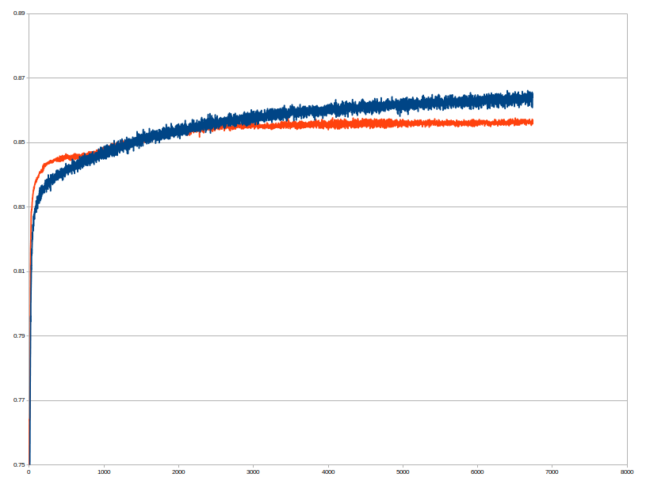

# Results for [Adult dataset](http://archive.ics.uci.edu/ml/datasets/Adult)

Data can be downloaded in WideOpenThouths format [here](todo), or original data can be downloaded [here](http://archive.ics.uci.edu/ml/machine-learning-databases/adult/). These results were achieved with [WideOpenThoughts](https://github.com/pepe78/WideOpenThoughts) using NVIDIA's GPU Geforce 1080Ti.

### config.txt

#### batch size 4000, log loss error, auto step size

> matrix,108,50,0.5,-0.001

> sigmoid,50

> dropout,50,0.5

> matrix,50,2,0.5,-0.001

> softmax,2

Top accuracy on test data: 85.80 %
