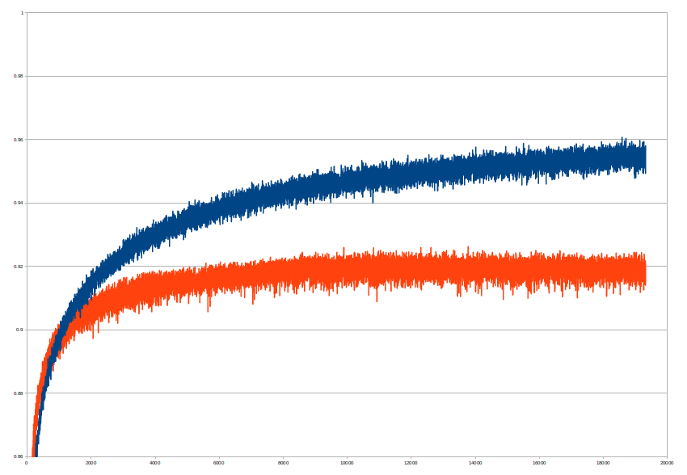

# Results for [Fashion MNIST](https://github.com/zalandoresearch/fashion-mnist)

Data can be downloaded in WideOpenThouths format [here](https://www.dropbox.com/s/ra0701e5ksxcayq/fashion_mnist.zip), or original data can be downloaded [here](https://github.com/zalandoresearch/fashion-mnist/tree/master/data/fashion). These results were achieved with [WideOpenThoughts](https://github.com/pepe78/WideOpenThoughts) & [DeeperThought](https://github.com/pepe78/DeeperThought) using NVIDIA's GPU Geforce 1080Ti.

### configG.txt (convolutional neural network CNN)

#### batch size 4000, log loss error, auto step size

> convolution,1,28,28,200,8,8,0.5,-0.001

> max,200,21,21,7,7

> matrix,1800,130,0.5,-0.001

> sigmoid,130

> dropout,130,0.5

> matrix,130,10,0.5,-0.001

> softmax,10

Top accuracy on test data: 91.67 %

### configK.txt (convolutional neural network CNN + preprocessing layer)

#### batch size 3500, log loss error, auto step size

> preprocess,28,28,-0.1,0.1,0.95,1.05,-0.05,0.05,0,1,140,140

> convolution,1,28,28,200,8,8,0.5,-0.001

> max,200,21,21,7,7

> matrix,1800,130,0.5,-0.001

> sigmoid,130

> dropout,130,0.5

> matrix,130,10,0.5,-0.001

> softmax,10

Top accuracy on test data: 92.63 %
